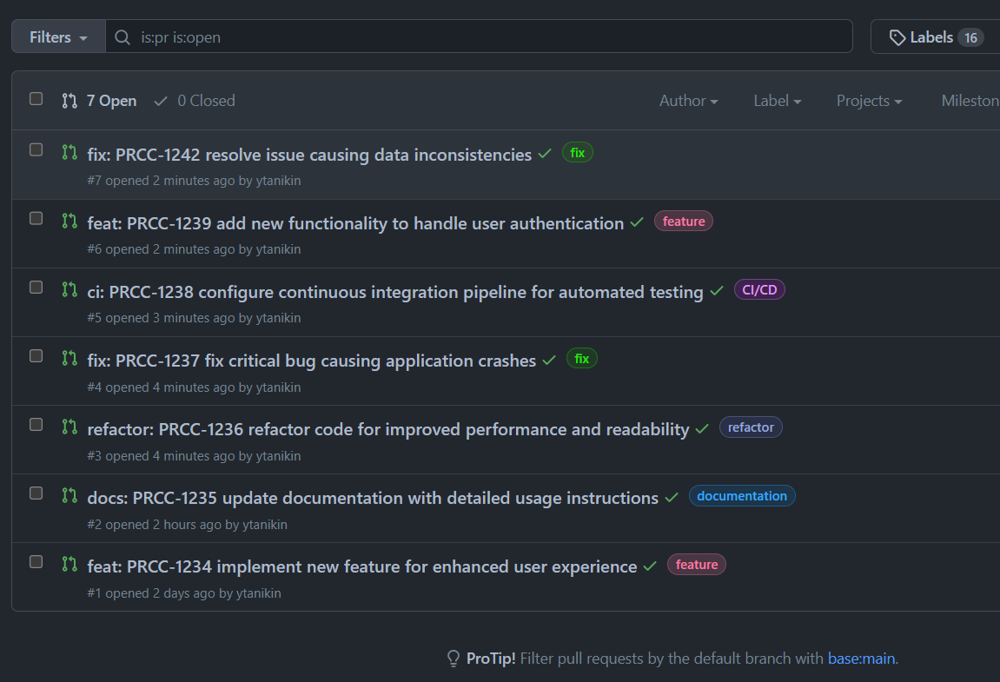

# Conventional Commit In Pull Requests GitHub Action

## Features

- Conventional Commit Validation: Checks that the PR title adheres to the [Conventional Commits](https://www.conventionalcommits.org/en/v1.0.0/) specification.
- Automatic Labeling: Labels the PR based on the task type mentioned in the title. Can be disabled.
- Ticket Number Validation: Optionally checks the provided ticket number format using regular expressions.

## Overview

Conventional Commits is a lightweight convention on top of commit messages. It provides an easy set of rules for creating an explicit commit history, which makes it easier to write automated tools on top of. This convention dovetails with SemVer, by describing the features, fixes, and breaking changes made in commit messages.

This GitHub Action checks that the PR title adheres to the [Conventional Commits](https://www.conventionalcommits.org/en/v1.0.0/) specification. If the PR title contains a valid task type and optionally a task number, it labels the PR based on the task type.

### Why Conventional Commits?

- **Automatic Generation of CHANGELOGs**: With Conventional Commits, CHANGELOGs can be automatically generated, making it easier for users to find what's changed between releases.
- **Explicitly Communicate Nature of Changes**: Conventional commits establish a clear guideline, making it easier for people to contribute to your projects.
- **Simple Navigation through Git History**: Conventional commits make it easy to identify the nature of changes (fix, feat, chore, etc.) when searching through the git commit history.
- **Compatibility with Semantic Versioning (SemVer)**: Conventional Commits provides a structured format for commit messages, which aligns with SemVer and helps understand version changes without reading the code.
- **Labeling PRs**: By labeling PRs based on the task type, it provides a visual indication of the nature of changes and helps in organizing and prioritizing PR reviews.

### Inputs

- `task_types` (required): An array of task types. Example: `["feat","fix","docs","test","ci","refactor","perf","chore","revert"]`.
- `ticket_key_regex` (optional): Regular expression to match issue number in PR title. Default is not validating. Example: `"^PROJECT-\\d{2,5}$"`.
- `add_label` (optional): Whether to add labels. Default is `'true'`.
- `custom_labels` (optional): A JSON string mapping task types to custom label names. Example: `{"feat": "feature", "fix": "fix", "docs": "documentation", "test": "test", "ci": "CI/CD", "refactor": "refactor", "perf": "performance", "chore": "chore", "revert": "revert", "wip": "WIP"}`.

### Labeling Pull Requests
When a pull request title adheres to the Conventional Commits specification, this action can automatically label the pull request based on the task type. Labels provide filtering PRs by a label, a visual indication of the nature of changes, aiding in organizing and prioritizing PR reviews.

By default, this action adds labels based on the task type. For example, a pull request with a task type of `ci` will be labeled as `CI/CD`. You can customize the label names by providing a `custom_labels` input.

If you prefer not to add labels, you can disable the labeling functionality by setting the `add_label` input to `'false'`. In such cases, the action will still validate the PR title against the Conventional Commits specification but will not add any labels.


### Configuring Squash Merging

When merging pull requests, you can configure the merge behavior, including the option for squashing. Please follow these steps:

Go to your repository's Settings tab.
Select the Options menu on the left sidebar.
Under the Merge button section, you will find the merge options.
To enable squash merging, select the checkbox for Allow squash merging.
Make sure that at least one merge option is enabled (merge commits, squashing, or rebasing).

When using the squash merge option, all commits from the head branch will be combined into a single commit in the base branch. The default commit message presented when merging a pull request with squash will include the PR title.
## Examples

### Basic Usage, no label, no ticket numbers validation

This configuration checks for conventional commits using the specified `task_types` but doesn't add any labels or validate ticket numbers.

Add a step that uses this action in your workflow file:

```yaml
name: PR Conventional Commit Validation

on:
  pull_request:
    types: [opened, synchronize, reopened, edited]

jobs:
  validate-pr-title:
    runs-on: ubuntu-latest
    steps:
      - name: PR Conventional Commit Validation
        uses:  ytanikin/PRConventionalCommits@1.1.0
        with:
          task_types: '["feat","fix","docs","test","ci","refactor","perf","chore","revert"]'
          add_label: 'false'
```

For this configuration, the following PR title is valid: `feat: add new feature`

### Usage, with ticket numbers validation, no labeling

This configuration checks for conventional commits using the specified `task_types` and validates ticket numbers, but doesn't add any labels.

Add a step that uses this action in your workflow file:

```yaml
name: PR Conventional Commit Validation

on:
  pull_request:
    types: [opened, synchronize, reopened, edited]

jobs:
  validate-pr-title:
    runs-on: ubuntu-latest
    steps:
      - name: PR Conventional Commit Validation
        uses:  ytanikin/PRConventionalCommits@1.1.0
        with:
         task_types: '["feat","fix","docs","test","ci","refactor","perf","chore","revert"]'
         add_label: 'false'
         ticket_key_regex: 'PROJECT-\d{2,5}'
```

For this configuration, the following PR title is valid: `feat: PROJECT-12345 add new feature`

## Usage with labeling, where label is just a task type

This configuration checks for conventional commits using the specified `task_types` and adds labels according to the task type.

Add a step that uses this action in your workflow file:

```yaml
name: PR Conventional Commit Validation

on:
  pull_request:
    types: [opened, synchronize, reopened, edited]

jobs:
  validate-pr-title:
    runs-on: ubuntu-latest
    steps:
      - name: PR Conventional Commit Validation
        uses:  ytanikin/PRConventionalCommits@1.1.0
        with:
          task_types: '["feat","fix","docs","test","ci","refactor","perf","chore","revert"]'
```

For this configuration, the following PR title is valid: `feat: add new feature`. **The PR will be labeled as** `feat`.

## Example Usage with ticket number validation and custom labeling

This configuration checks for conventional commits are using the specified `task_types`, validates ticket numbers, and adds custom labels.

Add a step that uses this action in your workflow file:

```yaml
name: PR Conventional Commit Validation

on:
  pull_request:
    types: [opened, synchronize, reopened, edited]

jobs:
  validate-pr-title:
    runs-on: ubuntu-latest
    steps:
      - name: PR Conventional Commit Validation
        uses:  ytanikin/PRConventionalCommits@1.1.0
        with:
         task_types: '["feat","fix","docs","test","ci","refactor","perf","chore","revert"]'
         ticket_key_regex: '^PROJECT-\\d{2,5}$'
         custom_labels: '{"feat": "feature", "fix": "fix", "docs": "documentation", "test": "test", "ci": "CI/CD", "refactor": "refactor", "perf": "performance", "chore": "chore", "revert": "revert", "wip": "WIP"}'
```

For this configuration, the following PR title is valid: `feat: PROJECT-12345 add new feature`.
**The PR will be labeled as `feature`.**

### Troubleshooting

- If you encounter an error message: `Error: Resource not accessible by integration`, adjust your repository settings. Go to your repository's settings, navigate to the "Actions" tab, and under the "General" section, update the "Workflow permissions" setting to "Read and Write Permission". This grants the necessary permissions for the action to function correctly.

- If you need to use a different GitHub token instead of the default `GITHUB_TOKEN`, you can provide your own token as the `token` input to the action.

### Contributing

After modifying the code, please run:
1. `npm test` to run test 
2. `npm run prepare` to build the distribution files(`dist` folder with `index.js.map` file). Commit it together with the changes in `index.js` file.

You can verify your changes by editing the title of your PR. The PR uses an action located in the root directory of the repository or the branch associated with your PR. 

## Author

👤 **YTanikin**

- Website: https://medium.com/@ytanikin
- Github: [@ytanikin](https://github.com/ytanikin)

## 🤝 Contributing

Contributions, issues and feature requests are welcome!<br />Feel free to check [issues page](https://github.com/ytanikin/PRConventionalCommits/issues).
